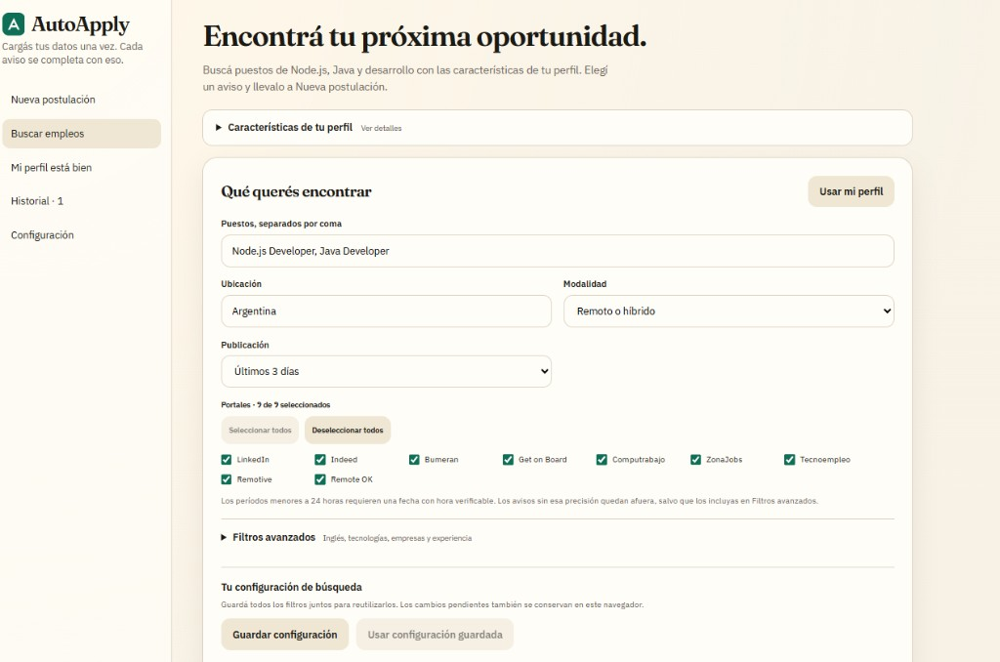
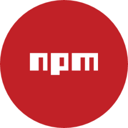
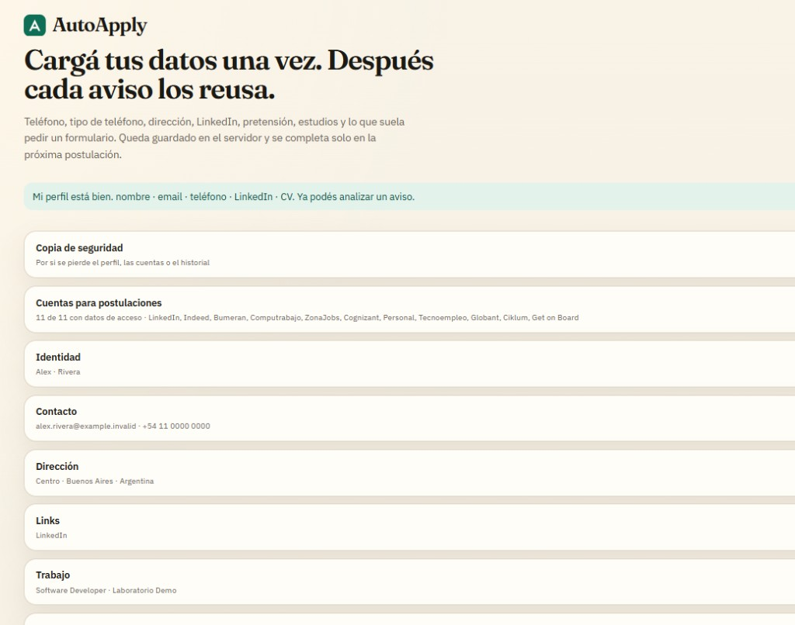
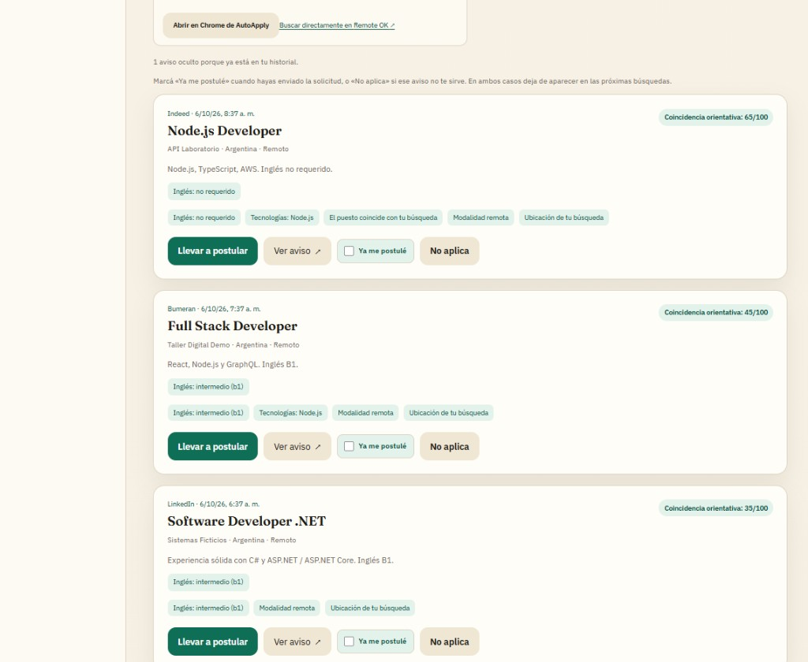
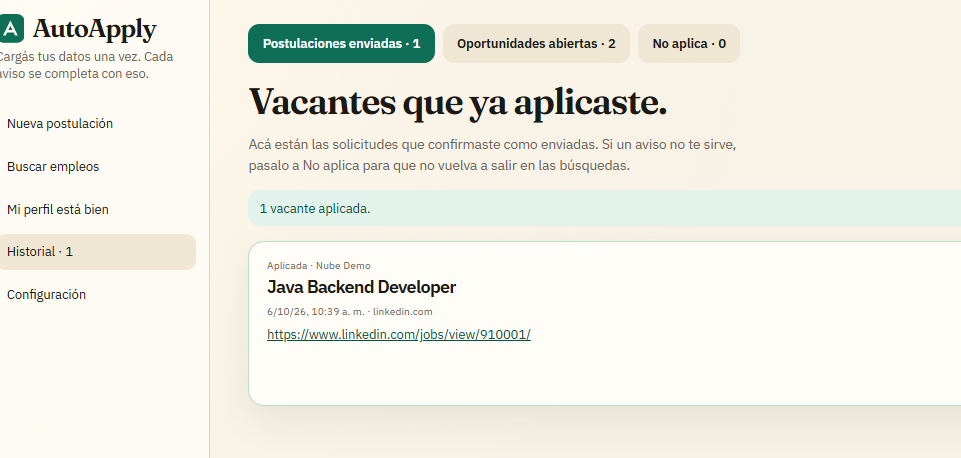
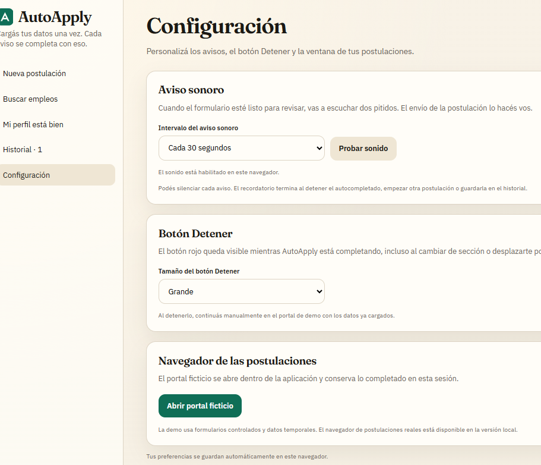

<div align="center">

<div align="right">



</div>
</div>

<br>

<br>

<div align="right">
  <a href="./README.md" title="Español">
    
  </a>
  <a href="./doc/assets/translation/README.en.md" title="Inglés">
    
  </a>
</div>

<div align="center">

# AutoApply 

</div>

AutoApply es una aplicación que busca oportunidades con tu perfil, completa la postulación y te devuelve el control antes de enviar. Cargás tus datos **una vez** y cada aviso se rellena con eso: **buscá, completá, confirmá.** El envío final lo hacés vos — más avisos cubiertos, cero envíos a ciegas.

<div align="left">
<a href="https://autoapply-demo-1tjt.onrender.com/" target="_blank" rel="noopener noreferrer" title="Ver live"></a>
</div>

<br>

<table>
  <tr>
    <td width="50%"></td>
    <td width="50%"></td>
  </tr>
  <tr>
    <td width="50%"></td>
    <td width="50%"></td>
  </tr>
</table>

<br>

## Índice 📜

<details>
  <summary> Ver detalle </summary>

<br>

<div align="right">

`Última actualización: 06/10/26`

</div>

### Sección 1) Descripción, configuración y tecnologías

* [1.0) Descripción.](#10-descripción-)
* [1.1) Ejecución.](#11-ejecución-)
* [1.2) Estructura.](#12-estructura-)
* [1.3) Tecnologías.](#13-tecnologías-)

### Sección 2) Flujo de uso y comportamiento

* [2.0) Flujo de la app.](#20-flujo-de-la-app-)
* [2.1) Perfil y documentos.](#21-perfil-y-documentos-)
* [2.2) Búsqueda de empleos.](#22-búsqueda-de-empleos-)
* [2.3) Autocompletado y envío.](#23-autocompletado-y-envío-)
* [2.4) Privacidad, datos y límites.](#24-privacidad-datos-y-límites-)

### Sección 3) Pruebas, demo alojada y referencias

* [3.0) Prueba funcional.](#30-prueba-funcional-)
* [3.1) Sandbox alojado (Render).](#31-sandbox-alojado-render-)
* [3.2) Contribuir.](#32-contribuir-)
* [3.3) Licencia.](#33-licencia-)

</details>

<br>

## Sección 1) Descripción, configuración y tecnologías

### 1.0) Descripción [🔝](#índice-)

<details>
  <summary>Ver detalle</summary>

<br>

Postular hoy es un segundo trabajo: el mismo teléfono, el mismo CV y las mismas respuestas, una y otra vez, en LinkedIn, Indeed, Bumeran y el ATS de turno.

AutoApply corta esa fricción. **Un perfil. Una búsqueda que entiende tu stack. Un autocompletado que escribe por vos.** Un historial para no postular dos veces. Y un principio que no se negocia: vos mandás la solicitud. No es un bot que dispara CVs a ciegas; es un asistente que acelera lo repetible y te deja lo que importa.

Probá el producto en un minuto, sin instalar nada: **[demo en Render](https://autoapply-demo-1tjt.onrender.com/)** — perfil ficticio, portal de prueba, cero cuentas reales.

Para qué existe:

* El copy-paste entre portales come horas y genera errores. AutoApply concentra tus datos y los escribe en el formulario.
* Un “apply automático” que pulsa Enviar sin revisión es el atajo que más daño hace. Acá el envío es **manual a propósito**.
* Reclutadores y reviewers recorren la **misma interfaz** en [https://autoapply-demo-1tjt.onrender.com](https://autoapply-demo-1tjt.onrender.com/) (ver 3.1).

Qué entrega el producto:

* **Encontrá avisos que encajan.** Portales como LinkedIn, Indeed, Bumeran, Get on Board, Computrabajo, ZonaJobs, Tecnoempleo, Remotive y Remote OK, con filtros de puesto, modalidad, tecnologías e idiomas — y un puntaje de coincidencia para priorizar, no para prometer una oferta.
* **Cargá el perfil una vez.** Identidad, contacto, experiencia por tecnología, estudios, CV (PDF, DOC, DOCX) y respuestas habituales. El próximo aviso reutiliza todo.
* **Autocompletá, no envíes a ciegas.** Chromium propio: texto, selects, radios, adjuntos. El botón rojo **Detener** te devuelve el control con lo ya cargado.
* **Seguí el rastro.** Historial de enviadas, oportunidades abiertas y “no aplica”, para no repetir ni volver a ver lo que ya descartaste.
* **Tus datos se quedan con vos.** Perfil, cuentas y backups en tu máquina. La demo pública usa un perfil inventado y no toca portales reales.

**Requisitos (versión local):**

* [Node.js](https://nodejs.org/) **22.13+** (recomendado 22.14).
* npm.
* Chromium de Playwright (`npx playwright install chromium`).
* Entorno gráfico: los formularios se ven y se terminan a mano.
* Conexión a Internet para portales y, si la configurás, asistencia opcional.

**Requisitos (demo):** Node.js y npm. No instala ni lanza Chrome.

</details>

### 1.1) Ejecución [🔝](#índice-)

<details>
  <summary>Ver detalle</summary>

<br>

#### Versión local (aplicación completa)

Desde la raíz del proyecto AutoApply:

```bash
npm ci
npx playwright install chromium
```

Si no existe `.env`, copiá la plantilla (nunca subas `.env`):

```bash
cp .env.example .env
```

Arranque:

```bash
npm run dev
```

La app queda en `http://127.0.0.1:8787`. Si está ocupado, prueba 8788 y sigue hacia arriba. La terminal muestra la dirección efectiva. Interfaz, API y recarga en vivo comparten **un solo puerto**.

| Variable | Rol |
|----------|-----|
| `PORT` | Puerto inicial (por defecto `8787`; solo se usan puertos desde 8787 hacia arriba) |
| `CURSOR_API_KEY` | Asistencia opcional para controles no reconocidos y adaptación de cartas. Vacío = solo reglas locales |

**No** subas `.env` al repositorio. No hace falta ninguna clave para usar búsqueda, perfil, autocompletado ni historial.

#### Demo pública (la que se hospeda en Render)

```bash
npm ci
npm run build:demo
npm run start:demo
```

Abre `http://127.0.0.1:8788` (o el siguiente puerto libre). Puede convivir con la app local en 8787. Después de cambiar código, reconstruí y reiniciá la demo.

#### Scripts útiles

| Script | Descripción |
|--------|-------------|
| `npm run dev` | Aplicación completa en local (API + interfaz) |
| `npm start` | Mismo entry que `dev` |
| `npm run build:demo` | Compila la demo pública |
| `npm run start:demo` | Sirve la demo (el proceso que usa Render) |
| `npm test` | Suite nativa (`node --test`) |

</details>

### 1.2) Estructura [🔝](#índice-)

<details>
  <summary>Ver detalle</summary>

```
autoapply/
├── Interfaz web
│   React + Vite: perfil, búsqueda, postulación, historial y ajustes
├── API local
│   Node.js en un solo proceso: orquesta persistencia, búsqueda y llenado
├── Motor de formularios
│   Chromium propio (Playwright): completa campos; vos enviás
├── Datos en disco
│   Perfil, historial, preferencias y backups en la máquina
├── Demo pública
│   Sandbox para Render: perfil ficticio, sin cuentas reales ni envíos
└── Documentación
    README en español e inglés (este repositorio)
```

No es un monorepo de microservicios ni un ATS en la nube. Un proceso, una interfaz, un navegador administrado. La demo **no** reutiliza el arranque personal: es un módulo aparte, pensado para mostrarse sin filtrar datos privados.

</details>

### 1.3) Tecnologías [🔝](#índice-)

<details>
  <summary>Ver detalle</summary>

<br>

| **Tecnología** | **Versión** | **Propósito** |
| -------------- | ----------- | ------------- |
| [React](https://react.dev/) | **19.x** | **Interfaz** |
| [Vite](https://vite.dev/) | **8.x** | **Build y recarga**; en local va integrado al servidor |
| [Node.js](https://nodejs.org/) | **≥ 22.13** | **Runtime** de la API y de la demo |
| [Playwright](https://playwright.dev/) | **1.x** | **Chromium** para autocompletado (solo versión local) |
| [PDF.js](https://mozilla.github.io/pdf.js/) | **6.x** | **Lectura de CV** en PDF |
| HTTP nativo (`node:http`) | **built-in** | **API local**, sin Express |
| [Render](https://render.com/) | **Free** | **Sandbox público** de la demo |

**Módulos nativos:** `node:http`, `node:fs` / `node:path`, `node:test`.

**Docs oficiales:**

* React: <https://react.dev/>
* Vite: <https://vite.dev/>
* Playwright: <https://playwright.dev/>
* Node.js: <https://nodejs.org/docs/latest/api/>
* Render Blueprint spec: <https://render.com/docs/blueprint-spec>

La demo de Render **no** lanza Playwright. El recorrido público usa un portal de prueba del mismo origen.

</details>

<br>

## Sección 2) Flujo de uso y comportamiento

### 2.0) Flujo de la app [🔝](#índice-)

<details>
  <summary>Ver detalle</summary>

<br>

La interfaz es la misma idea en local y en la demo. Cambia el alcance: local habla con portales reales; la demo, con un catálogo y un formulario de prueba.

| Entorno | Para |
|---------|------|
| **Local** | `http://127.0.0.1:8787` — uso personal, Chromium, portales reales |
| **Demo (Render)** | [autoapply-demo-1tjt.onrender.com](https://autoapply-demo-1tjt.onrender.com/) — perfil ficticio, sin postulaciones a empresas |

1. Completás (o revisás) **Mi perfil**: nombre, contacto, experiencia, CV.
2. Elegís un aviso: lo pegás en **Nueva postulación** o lo llevás desde **Buscar empleos**.
3. Opcional: **Analizar** para ver campos y respuestas sugeridas antes de abrir el navegador.
4. **Autocompletar** abre o reutiliza la pestaña en el Chromium de AutoApply y llena lo que puede resolver.
5. Revisás el resultado real: campos con datos, obligatorios pendientes, validaciones y pasos manuales.
6. Completás CAPTCHA, códigos y cualquier control que la app no deba inventar.
7. Enviás **desde el sitio**. AutoApply no pulsa el botón final por vos.
8. Confirmás **Ya envié la postulación** para guardarla en el historial y activar duplicados.

Atajos: **Enter** analiza; **Ctrl+Enter** (o **Cmd+Enter**) autocompleta. Varios enlaces arman una cola; **Siguiente de la cola** avanza cuando vos querés.

</details>

### 2.1) Perfil y documentos [🔝](#índice-)

<details>
  <summary>Ver detalle</summary>

<br>

El perfil es el insumo del producto. Con nombre, apellido, email y teléfono ya se puede arrancar; el resto (experiencia por tecnología, estudios, disponibilidad, respuestas reutilizables) es lo que evita formularios a medias.

| Pieza | Qué hace |
|-------|----------|
| Datos personales y profesionales | Se mapean a campos de texto, fechas, selects y radios |
| Experiencia por tecnología | Java no se convierte en “años de React”: cada stack tiene su dato |
| Respuestas guardadas | Preguntas repetidas (autorización, disponibilidad, salario) se reutilizan |
| CV | PDF / DOC / DOCX, hasta 8 MiB; se puede tener más de una variante |
| Carta / comentarios | Texto base; se escribe en un campo o se adjunta si el formulario lo pide |

El motor lee etiquetas, nombres, roles accesibles y contexto cercano. Un placeholder vacío no cuenta como respuesta. Escalas subjetivas y proyectos concretos piden una respuesta propia: no se rellena con un párrafo genérico.

La asistencia opcional (si hay clave de agente) solo entra cuando las reglas locales no alcanzan. Si falla o no está configurada, el flujo sigue con el perfil y el léxico locales. Revisá siempre el texto sugerido antes de enviar.

</details>

### 2.2) Búsqueda de empleos [🔝](#índice-)

<details>
  <summary>Ver detalle</summary>

<br>

**Buscar empleos** consulta avisos públicos y los filtra en AutoApply. Un portal listado no garantiza que siempre deje scrapear: si restringe el acceso, la app lo informa y conserva lo que sí obtuvo.

Filtros que importan en la práctica:

* Puestos (hasta tres), ubicación, modalidad, tipo de contrato y seniority.
* Antigüedad: de pocas horas a 30 días, o un período a medida.
* Tecnologías obligatorias, opcionales y excluidas, con catálogo y opciones propias.
* Inglés con techo configurable (el valor inicial es intermedio B1) e idiomas extra.
* Palabras y empresas a excluir.
* Ocultar lo que ya confirmaste como enviado.

**Guardar configuración** persiste el juego de filtros en el servidor local. Editar la pantalla no relanza la búsqueda: hay que volver a buscar. Las tarjetas muestran los criterios de **esa** consulta, no los que editaste después.

Cada resultado trae empresa, fecha, coincidencias y pendientes de revisar. **Ver aviso** registra la oportunidad. **Llevar a postular** arma Nueva postulación. **Ya me postulé** marca el envío sin repetir la búsqueda.

</details>

### 2.3) Autocompletado y envío [🔝](#índice-)

<details>
  <summary>Ver detalle</summary>

<br>

Autocompletar **no** es postular. Abrir un aviso, llenar campos y confirmar el envío son tres acciones distintas.

Durante el llenado:

* Se reutiliza la pestaña del aviso cuando se puede.
* Se detecta login, verificación o formulario y se actúa en consecuencia.
* Las cuentas guardadas se usan solo en el dominio que les corresponde.
* Si aparece un CAPTCHA o un código, la app deja los datos cargados y te devuelve el control. Resolverlo no dispara una ráfaga de reintentos.

**Detener autocompletado** (botón rojo) invalida la ejecución, espera a que terminen las escrituras ya empezadas y conserva el borrador. No es lo mismo que cerrar el navegador. Recargar la interfaz no relanza el llenado.

Cuando el formulario se verificó como listo para revisión, un aviso sonoro opcional lo recuerda (15 / 30 / 60 s, o silencio). El sonido no envía nada: solo avisa.

Después del Enviar del portal, **Ya envié la postulación** cierra el ciclo en AutoApply. Sin esa confirmación, el aviso no entra al historial de enviados y no bloquea un nuevo intento.

Hay reconocimiento de plataformas habituales de empleo (ATS y portales). Reconocer el enlace no equivale a cubrir todas las variantes de ese sitio: los formularios cambian.

</details>

### 2.4) Privacidad, datos y límites [🔝](#índice-)

<details>
  <summary>Ver detalle</summary>

<br>

#### Qué queda en tu máquina (versión local)

Perfil, cuentas de portales, historial, preferencias de búsqueda y backups viven en archivos locales. La API escucha en `127.0.0.1`. No hay cuentas multiusuario ni un servidor público de la versión personal.

Las credenciales se guardan como JSON local, **sin cifrado propio de la app**. Protegé el acceso a la computadora y a las copias exportadas. `.gitignore` deja afuera datos, backups y `.env`.

El backup incluye perfil, cuentas, historiales, configuración de búsqueda y CV en Base64. **No** incluye `.env`, el perfil de Chromium ni el almacenamiento del navegador de la interfaz.

#### Qué hace (y no hace) la demo

* Perfil ficticio, avisos inventados, portal de prueba.
* Sesión por visitante, en memoria, con vencimiento.
* No lee el disco personal, no lanza Chrome, no entra a LinkedIn ni a ningún empleador real.

#### Límites honestos

* El envío final, CAPTCHA y MFA son manuales.
* La búsqueda no es un índice exhaustivo ni un cron 24/7.
* Detectar un campo no reemplaza revisar la solicitud.
* Un “status: listo para revisar” no significa que el portal ya recibió el CV.
* La demo de Render Free se duerme con inactividad; la primera visita puede tardar.

</details>

<br>

## Sección 3) Pruebas, demo alojada y referencias

### 3.0) Prueba funcional [🔝](#índice-)

<details>
  <summary>Ver detalle</summary>

<br>

#### 3.0.1) Recorrido recomendado (demo)

1. Abrí **Mi perfil** y mirá (o editá) los datos ficticios. No cargues información personal en el sandbox público.
2. En **Buscar empleos**, mové filtros: publicación, tecnologías, idiomas, exclusiones.
3. Abrí un aviso o **Llevar a postular**. Los enlaces del catálogo se ven dentro del portal de prueba.
4. **Autocompletar**. Probá **Detener** y continuar a mano.
5. Enviá la solicitud **ficticia** en el portal de prueba. Confirmá **Ya envié la postulación** (o **Ya me postulé** en resultados).
6. **Reiniciar demo** vuelve al ejemplo inicial.

Credenciales de prueba del portal ficticio (no sirven en sitios reales):

`alex.rivera@example.invalid` / `Demo-Only-2026!`

#### 3.0.2) Tests automatizados

```bash
npm test
```

La suite cubre filtros, historial, detención, persistencia, aislamiento de la demo y recorridos de interfaz con Playwright. No necesita que tengas AutoApply abierto. Las pruebas no postulan a empresas ni usan cuentas reales.

#### 3.0.3) Salud del proceso

```bash
# local
curl -s http://127.0.0.1:8787/api/health

# demo local
curl -s http://127.0.0.1:8788/api/health

# demo en Render
curl -s https://autoapply-demo-1tjt.onrender.com/api/health
```

</details>

### 3.1) Sandbox alojado (Render) [🔝](#índice-)

<details>
  <summary>Ver detalle</summary>

<br>

Demo pública: **[https://autoapply-demo-1tjt.onrender.com](https://autoapply-demo-1tjt.onrender.com/)**

El servicio en Render **es la demo** (`build:demo` + `start:demo`), no la aplicación personal. Instancia Free: HTTPS, perfil ficticio, sin Playwright y sin disco persistente.

| Esto sí | Esto no (Free) |
|---------|----------------|
| Recorrer perfil, búsqueda, autocompletado y historial con datos de ejemplo | Postular a un empleo real |
| Aislamiento por visitante mientras el contenedor está despierto | Conservar lo de ayer: al dormir o redeploy, el ejemplo vuelve a cero |
| Health check en `/api/health` | Arranque instantáneo: la primera visita puede tardar ~30–60 s |
| Mostrar el producto a un reviewer | Chrome de AutoApply, backups, CVs personales, cuentas de portales reales |

Cerrar el navegador **no** borra la sesión de otro visitante. Un sleep o un redeploy sí reinician el ejemplo. Es un sandbox para ver el producto, no un gestor de postulaciones con historia.

Blueprint: `render.yaml`. Node `22.14.0`. `NODE_ENV=production`.

</details>

### 3.2) Contribuir [🔝](#índice-)

<details>
  <summary>Ver detalle</summary>

<br>

1. Fork del proyecto.
2. Creá una rama (`git checkout -b feature/mi-mejora`).
3. Commit (`git commit -m 'feat: descripción corta'`).
4. Push (`git push origin feature/mi-mejora`).
5. Abrí un Pull Request.

No subas secretos a git (`.env`, perfil real, CVs, cuentas de portales, backups). Documentá cambios de producto en ambos README (inglés + este).

</details>

### 3.3) Licencia [🔝](#índice-)

<details>
  <summary>Ver detalle</summary>

<br>

ISC. Desarrollado por [Andrés Weitzel](https://github.com/andresWeitzel).

**Links:**

* **README en inglés:** [doc/assets/translation/README.en.md](./doc/assets/translation/README.en.md)
* **Sandbox (Render):** [autoapply-demo-1tjt.onrender.com](https://autoapply-demo-1tjt.onrender.com/)

</details>
